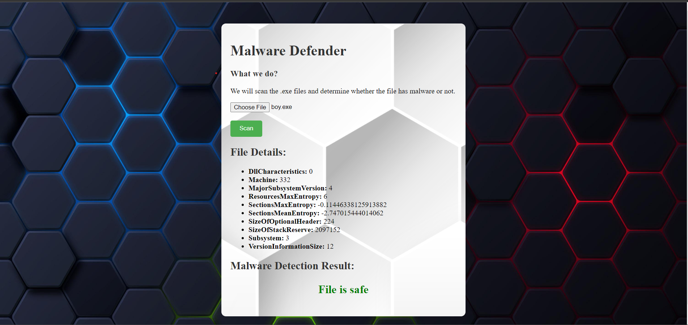

# Malware Defender
Malware Defender is a web application designed to scan .exe files and determine whether they contain malware or not. It leverages machine learning algorithms to perform malware detection and provides detailed information about the scanned file.
## Features
- **Malware Detection**: The application utilizes machine learning algorithms to detect whether a scanned .exe file contains malware or is safe.
- **File Analysis**: Malware Defender analyzes various attributes and characteristics of the file to assess its safety.
- **Detailed Information**: The application provides detailed information about the scanned file, including DllCharacteristics, Machine, MajorSubsystemVersion, ResourcesMaxEntropy, SectionsMaxEntropy, SectionsMeanEntropy, SizeOfOptionalHeader, SizeOfStackReserve, Subsystem, and VersionInformationSize.
- **User Interface**: Malware Defender offers a user-friendly web interface for easy file upload and scanning.
- **Background Indication**: The application visually indicates the malware detection result by changing the background color to red for malware detected and green for safe files.
- **Error Handling**: Malware Defender provides warnings for incorrect file types and missing file uploads to enhance user experience and ensure accurate scanning.
  
## Attributes
- **DllCharacteristics**: Identifies the DLL characteristics of the scanned file.
- **Machine**: Determines the machine architecture for which the executable was created.
- **MajorSubsystemVersion**: Retrieves the major subsystem version of the executable.
- **ResourcesMaxEntropy**: Calculates the maximum entropy of the resources in the file.
- **SectionsMaxEntropy**: Computes the maximum entropy among the sections in the executable.
- **SectionsMeanEntropy**: Computes the mean entropy of the sections in the executable.
- **SizeOfOptionalHeader**: Retrieves the size of the optional header in the file.
- **SizeOfStackReserve**: Determines the size of the stack to be reserved for the executable.
- **Subsystem**: Identifies the subsystem required to run the executable.
- **VersionInformationSize**: Retrieves the size of the version information in the file.
  
## Getting Started
To use Malware Defender, follow these steps:
1. Clone the repository: **'git clone https://github.com/karthikbolla/MalwareDefender.git'**
2. Install the required dependencies: **'pip install -r requirements.txt'**
3. Run the application: **'python app.py'**
4. Access the web interface at **http://localhost:5000**

## Usage
1. Upload a .exe file using the provided file input.
2. Click the "Scan" button to initiate the malware detection process.
3. The application will analyze the file and display the results.
4. The "File Details" section provides detailed information about the scanned file.
5. The "Malware Detection Result" section indicates whether the file contains malware or is safe.

## Website interface

## Contributing
Contributions to Malware Defender are welcome! If you have any ideas, improvements, or bug fixes, feel free to submit a pull request. Please ensure that your code adheres to the project's coding standards.

## License
This project is licensed under the MIT License. See the [License](./LICENSE) file for more information.

## Acknowledgements
We would like to express our gratitude to the open-source community for their invaluable contributions and the various libraries and frameworks that made this project possible.

## Contact
For any inquiries or feedback, please contact us at karthikbolla123@gmail.com. We would be happy to assist you.
